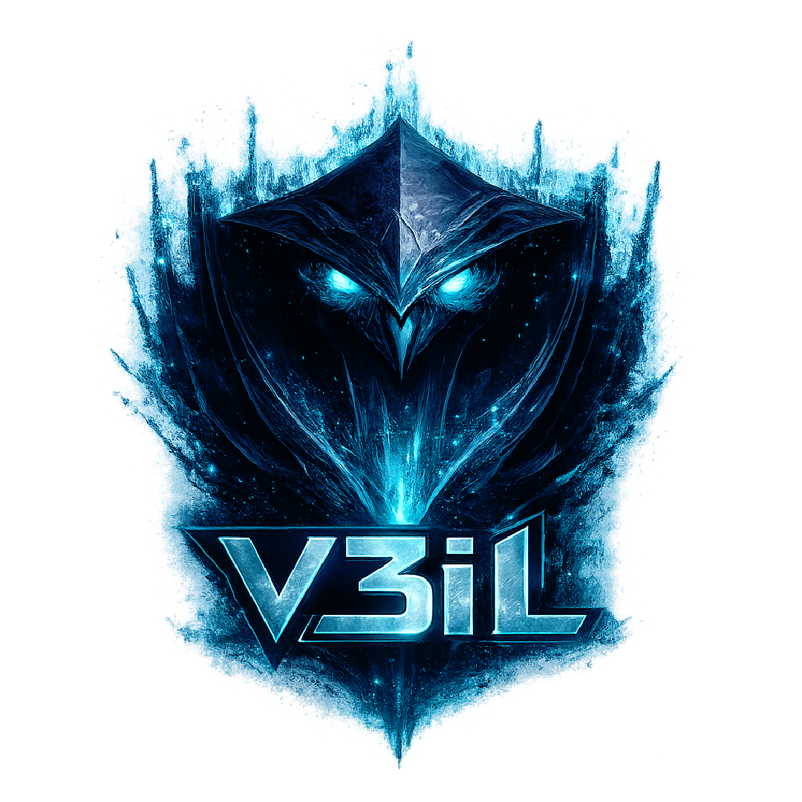
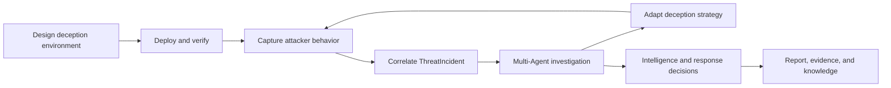
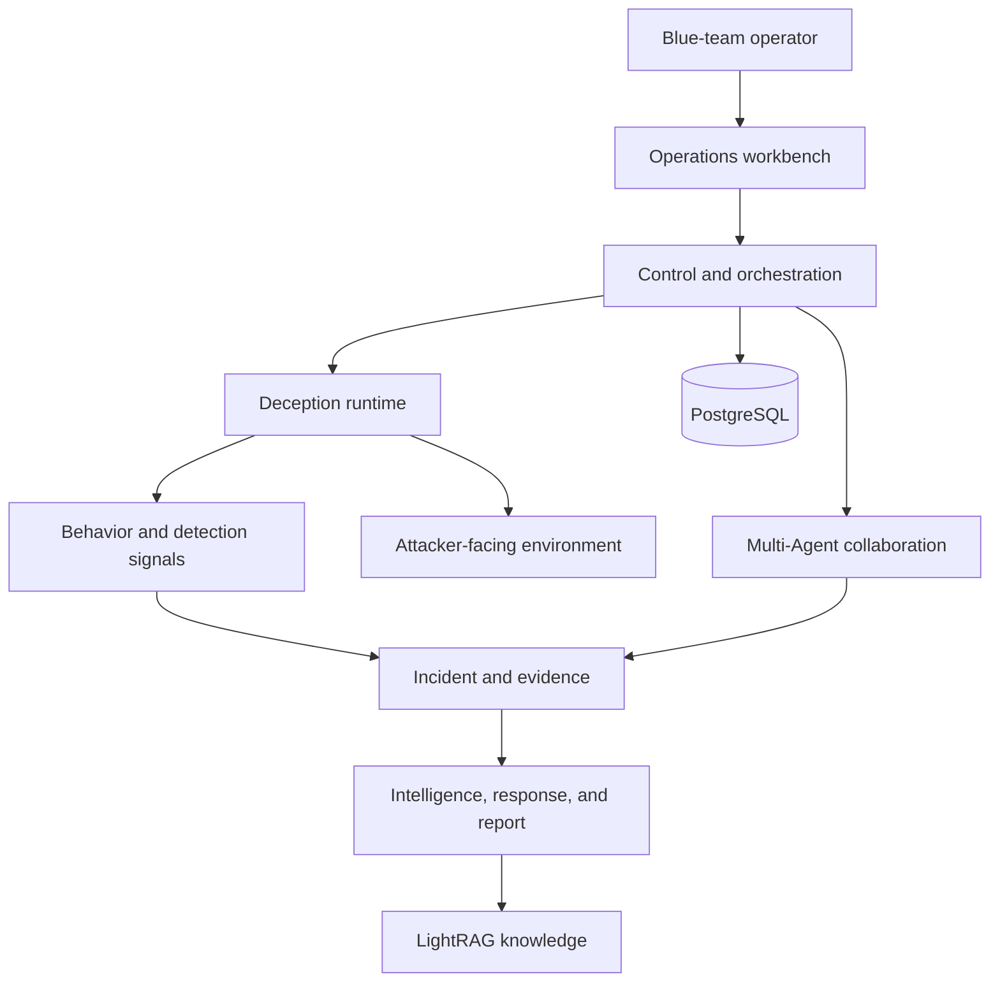

# V3il

<p align="center">
  
</p>

<p align="center"><strong>Hide the truth. Reveal the threat.</strong></p>

V3il is an autonomous blue-team operations platform for teams that need to observe, investigate, and respond to real attacker behavior. It uses programmable deception environments as the observation surface and connects behavior capture, Incident correlation, multi-Agent investigation, adaptive engagement, threat intelligence, and reporting in one operational workflow.

[中文说明](README_zh.md) | [Documentation](docs/en/index.md)

## Product Positioning

Deception creates a controlled place to observe an attacker. The operational value comes from what the team can learn and decide after the first interaction. V3il keeps environments, behavior, Incidents, investigation tasks, evidence, and analytical conclusions in the same context so a blue team can answer three questions throughout an operation:

- What is the attacker doing, and how are the actions related?
- Which environmental signals should change to test the next hypothesis?
- Which evidence supports the current conclusion, and is it ready for response or reporting?

V3il is designed for internal blue teams, threat research groups, and controlled security labs with explicit authorization, dedicated infrastructure, and a trusted management network.

## Core Workflow



The operator defines the environment objective, runtime location, image, egress policy, and reference material, then describes the intended business surface in the Agent Console. Once the environment is live, V3il collects behavior and detection signals, groups related activity into a ThreatIncident, and coordinates five specialist roles around the investigation. Findings can lead to a risk decision, a report, or another environment change that tests a hypothesis and captures the attacker's next move.

## Core Capabilities

- **Deception orchestration:** Design services, identities, data, and interaction paths from natural-language goals and reference material, with versioned environment changes.
- **Behavior and detection:** Combine network, process, command, file, authentication, service, and egress activity with Zeek detections in a continuous timeline.
- **Incident correlation:** Organize related activity across environments while preserving source, time, and environment relationships.
- **Multi-Agent investigation:** Divide work across investigation, deception, intelligence, response, and coordination roles.
- **Evidence and audit:** Track task scope, evidence references, analytical versions, review decisions, and material state changes.
- **Intelligence and reporting:** Produce intent, attack-chain reconstruction, indicators, attacker profiles, risk assessments, response guidance, reports, and evidence packages.
- **Operational infrastructure:** Manage Docker hosts, runtime images, containers, egress proxies, terminals, files, and knowledge.

## Architecture



The architecture has five primary concerns:

1. The **operations workbench** presents environments, Incidents, detections, intelligence, Agent work, and infrastructure.
2. The **control and orchestration layer** manages identity, resource lifecycle, task state, and recovery.
3. The **deception runtime** hosts attacker-facing services in controlled Docker environments.
4. The **behavior and evidence layer** owns correlation, investigation scope, evidence, analytical versions, and audit history.
5. The **Agent collaboration layer** advances investigation, environment adaptation, and review through role-based work.

## Five-Agent Team

| Code | Name | Role | Primary responsibility |
| --- | --- | --- | --- |
| `cso` | V3il | Chief Security Officer | Set investigation scope and plans, coordinate specialists, review conclusions, and manage Incident progress. |
| `cth` | H4wk | Threat Investigation Engineer | Reconstruct behavior, timelines, attack paths, and intent while maintaining the evidence chain. |
| `cde` | Ph4ntom | Deception Defense Engineer | Design, deploy, and adapt deception environments and verify each change. |
| `cie` | L1ly | Cyber Threat Intelligence Engineer | Develop indicators, external context, attacker profiles, and intelligence assessments. |
| `cir` | J4ck | Security Response Engineer | Assess risk and stop conditions, then recommend response priorities and defensive improvements. |

## Quick Start

V3il requires Linux, Docker Compose, PostgreSQL, five OpenAI-compatible Agent model endpoints, and the model endpoints used by LightRAG.

```bash
cp .v3il/config.json.example .v3il/config.json
cd sandbox
./build.sh
cd ..
docker compose -f docker-compose.prod.yml up -d --build
```

Open `http://127.0.0.1:8000`, sign in with the bootstrap administrator, verify the Managed Host and Sandbox Image, and create the first deception environment.

See [Quick Start](docs/en/guide/quick-start.md) and [First Use](docs/en/guide/first-use.md) for the guided setup.

## Operational Boundary

V3il manages Docker hosts, model credentials, and attacker behavior data. Keep the control plane, database, configuration, Docker management interfaces, reports, and evidence inside a trusted management network. Isolate attacker-facing environments from management and production networks. Captured credentials, tokens, and other sensitive data should follow the organization's access, audit, and retention policies.
