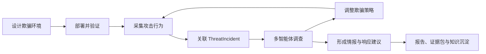
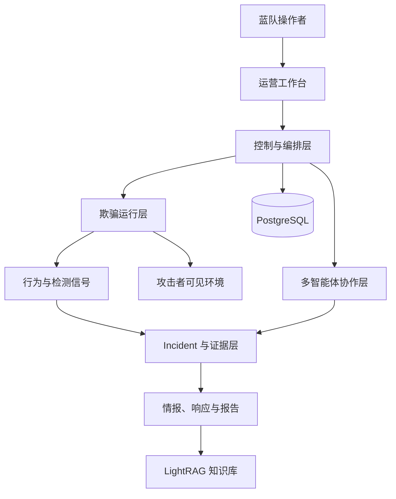

# V3il

<p align="center">
  
</p>

<p align="center"><strong>隐藏真实，揭露威胁。</strong></p>

V3il 面向需要持续观察、研判和处置真实攻击行为的蓝队。平台以可编排的欺骗环境作为观测入口，将攻击行为采集、事件关联、多智能体调查、动态诱导、威胁情报和报告交付组织在同一条运营链路中。

[English](README.md) | [产品文档](docs/zh/index.md)

## 产品定位

传统欺骗系统擅长制造攻击者可见的目标，后续调查往往仍依赖分散的日志、人工分析和独立报告流程。V3il 将环境、行为、Incident、调查任务、证据和分析结论放在同一上下文中，让蓝队可以持续回答三个问题：

- 攻击者正在做什么，行为之间如何关联；
- 下一步应调整哪些环境信号，以获得更有价值的观察；
- 当前结论由哪些证据支撑，是否足以进入响应与报告阶段。

平台适用于内部蓝队、威胁研究团队和受控安全实验环境。部署方需要具备明确授权、独立基础设施和可信管理网络。

## 核心链路



操作者先确定环境目标、运行位置、镜像、外联策略和参考资料，再在 Agent Console 中描述需要呈现的业务与交互。环境上线后，V3il 持续接收行为与检测信号，将相关活动汇入 ThreatIncident，并由五个固定角色协同调查。调查结果既驱动风险判断和报告，也可以触发新的环境调整，帮助团队验证假设并观察后续动作。

## 核心能力

- **欺骗环境编排：** 通过自然语言和参考资料设计服务、身份、数据与交互路径，并以版本化方式管理环境变化。
- **行为观测与检测：** 汇聚网络、进程、命令、文件、认证、服务和外联行为，结合 Zeek 检测形成连续时间线。
- **Incident 关联：** 将多个环境中的相关活动组织为一个调查对象，保留事件来源、时间范围和环境关系。
- **多智能体调查：** 按调查、欺骗、情报、响应和统筹五类职责分工，围绕明确任务协作。
- **证据与审计：** 记录任务范围、证据引用、分析版本、复核意见和关键状态变化，便于追溯结论。
- **情报与报告：** 输出攻击意图、攻击链、指标、攻击者画像、风险评估、响应建议、报告与证据包。
- **运营基础设施：** 管理 Docker 主机、运行镜像、容器、外联代理、终端、文件和知识库。

## 系统架构



架构围绕五个关注点展开：

1. **运营工作台**承载环境、Incident、检测、情报、智能体和基础设施管理；
2. **控制与编排层**管理身份、资源生命周期、任务状态和恢复；
3. **欺骗运行层**在受控 Docker 环境中承载攻击者可见服务；
4. **行为与证据层**负责事件关联、调查范围、证据、分析版本和审计；
5. **智能体协作层**根据角色和任务推进调查、环境调整与结论复核。

## 五智能体团队

| 编码 | 名称 | 角色 | 核心职责 |
| --- | --- | --- | --- |
| `cso` | V3il | Chief Security Officer | 制定调查范围和计划，协调专家，复核结论，管理 Incident 进程。 |
| `cth` | H4wk | Threat Investigation Engineer | 重建行为、时间线、攻击过程和意图，维护证据链。 |
| `cde` | Ph4ntom | Deception Defense Engineer | 设计、部署和调整欺骗环境，验证每次环境变更。 |
| `cie` | L1ly | Cyber Threat Intelligence Engineer | 整理指标与外部上下文，形成攻击者画像和情报判断。 |
| `cir` | J4ck | Security Response Engineer | 评估风险与停止条件，提出响应优先级和防御改进。 |

## 快速开始

V3il 需要 Linux、Docker Compose、PostgreSQL、五个兼容 OpenAI API 的模型端点，以及 LightRAG 所需的模型端点。

```bash
cp .v3il/config.json.example .v3il/config.json
cd sandbox
./build.sh
cd ..
docker compose -f docker-compose.prod.yml up -d --build
```

访问 `http://127.0.0.1:8000`，使用初始管理员登录，确认 Managed Host 和 Sandbox Image 后即可创建第一个欺骗环境。

详细步骤见[快速开始](docs/zh/guide/quick-start.md)和[首次使用](docs/zh/guide/first-use.md)。

## 运营边界

V3il 会管理 Docker 主机、模型凭据和攻击行为数据。控制平面、数据库、配置文件、Docker 管理接口、报告与证据文件应部署在可信管理网络中，并与攻击者可见网络和生产业务网络隔离。捕获到的凭据、令牌和其他敏感数据需要纳入组织现有的访问控制、审计和保留策略。
