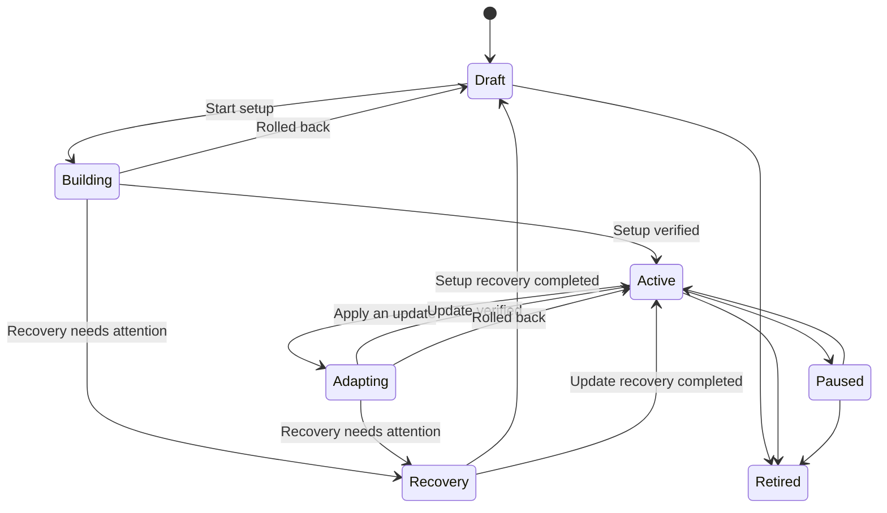

# Deception Environments

A deception environment is the observation surface in V3il. Each environment represents a defined business context and observation goal, presents services, identities, data, and interaction paths to an attacker, and continuously feeds behavior and detection signals into Incidents.

## Environment Design

Environment creation establishes the following design inputs:

| Input | Purpose |
| --- | --- |
| Name and description | Identify the environment, its business context, and operational owner. |
| Sandbox Container | Optionally select an unbound, running container with at least one service port mapping; the environment then owns that container exclusively. |
| Managed Host | Select the Docker host that will run the environment. |
| Sandbox Image | Select the runtime baseline and available capabilities. |
| Egress policy | Control outbound access and network identity. |
| Adaptation mode | Choose policy-based execution or operator approval. |
| Reference material | Supply sites, source code, documents, archives, or other design sources. |

When no existing container is selected, V3il stores the Managed Host, Sandbox Image, and egress configuration and creates a dedicated container when the initial environment version executes. When a container is selected, its host, image, egress, and port mappings become the immutable runtime contract for the environment. After creation, the operator uses the environment Agent Console to describe the persona, service shape, realistic data, interaction paths, and observation priorities. Ph4ntom develops the environment from this context.

## Lifecycle

### Design And Deployment

Ph4ntom turns the natural-language goal and reference material into an environment version that defines services, identities, data, interactions, and observation points. The platform deploys the version on the selected host and verifies the material behavior.

### Runtime And Observation

Once active, the attacker-facing services receive interaction. The environment workspace presents current services, runtime state, observed behavior, and version history.

### Adaptation And Rollback

When the investigation raises a new hypothesis, Ph4ntom can propose another environment version. Each change records its purpose, expected effect, risk, and verification outcome. If verification fails, V3il records the failure and returns the environment to an operable state.

Each revision captures the applied baseline and advances through explicit execution checkpoints. Service changes, container actions, detection updates, and verification results remain associated with that revision. A successful revision becomes the next baseline. A failed revision restores the previous baseline and records the resulting environment state for operator review.

Long-running sandbox commands execute as durable batches. The Agent work that requested the batch pauses against that specific operation and continues once with its combined result. Cancellation is propagated to queued and running commands. This keeps command output, environment state, and the requesting Agent context aligned across worker restarts.

Detection changes follow the same revision boundary. Rules are validated before deployment, associated with the target sensors, and tracked through deployment and health status. Recovery restores the last applied detection state together with the environment baseline, giving the next investigation step a consistent observation surface.

### Pause And Retirement

Operators can pause, resume, or retire an environment as the investigation changes. Before retirement, confirm the evidence, report, and retention requirements for the operation.

## Adaptive Engagement

Adaptive engagement changes the environment around a specific investigative question. Typical uses include:

- extending an observed attack path with a plausible next step;
- changing content, identity, or data to test attacker priorities;
- adding a service relationship that may expose lateral movement;
- placing observation points around a technique of interest;
- reducing high-risk interaction while preserving useful telemetry.

Behavior and evidence in the Incident motivate the change. Ph4ntom owns the design and verification, while V3il places the change in the broader investigation plan and review process.

## Adaptation Modes

- **`policy_auto`:** Low-risk changes permitted by policy can run automatically, which suits continuous research environments.
- **`manual_approval`:** Every change waits for operator approval, which suits sensitive subjects and strict change processes.

The environment workspace retains purpose, execution state, and verification results in either mode.

## Behavior Observation

V3il observes network, process, command, file, authentication, service, syscall, and egress activity. Zeek adds protocol and traffic detection, while environment sensors provide host and application behavior.

The environment workspace focuses on one runtime. The Incident workspace connects related behavior across environments and time periods.

## Operations

Infrastructure pages provide administrative access to:

- local and remote Managed Hosts;
- Sandbox Images and running containers;
- ports and egress proxies;
- container lifecycle;
- trusted terminal and file access;
- detection runtimes and health.

Use these controls for preparation, incident handling, and operational audit. An unbound container that was created and started from the container management page can be adopted while creating a deception environment; after binding, another environment cannot select or delete it. Keep attacker-facing networks separate from management networks.

## Failure Handling

When setup or an update fails, V3il automatically restores the environment to its previous usable state. The workspace keeps the failure and recovery outcome visible so the operator can correct the design and submit a new version. If automatic recovery cannot complete, the environment is clearly marked as requiring attention and further changes are paused until recovery succeeds. Resources supplied by the operator remain under operator control, while resources allocated for an unsuccessful setup are cleaned up by the platform.

Recovery is resumable from the last recorded checkpoint. The workspace presents the failed step, completed rollback work, remaining recovery work, and the baseline that will be restored. A recovery request continues that recorded process and preserves the original revision history. Once recovery completes, the environment returns to `draft` after an initial setup failure or `active` after an adaptation failure.
