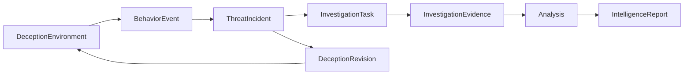

# Core Domain Models

The V3il domain follows a direct relationship: deception environments produce behavior, related behavior enters an Incident, investigation tasks cite that behavior and produce evidence, evidence supports analysis, and analysis enters reports and knowledge.

## Runtime Resources

| Concept | Purpose |
| --- | --- |
| System User | Represents an operator and their permissions. |
| Managed Host | Represents a Docker host that can run environments and detection services. |
| Sandbox Image | Defines the runtime baseline for an environment. |
| Sandbox Container | Represents a running environment or detection instance. |
| Egress Proxy | Defines a controlled outbound route. |

The control plane manages runtime resources and makes them available to deception environments through auditable selection.

## Agent Collaboration And Execution

Agent collaboration uses a durable hierarchy that separates the operator's workspace, a unit of work, and an execution attempt:

| Concept | Product meaning |
| --- | --- |
| Agent Session | The long-lived conversation and operational scope presented to the operator. |
| Agent Run | One accepted unit of work, including user requests, specialist assignments, and continuations. |
| Run Attempt | One owned execution of a Run. Recovery creates a new Attempt under the same business request. |
| Agent Context | The persistent working memory for one role within a Session. |
| Tool Invocation | The recorded intent and outcome of an external action. |
| Durable Event | The ordered history used by the Console, audit views, and reconnecting clients. |

Chat Sessions are created by operators. An Incident and a deception environment each have one canonical scoped Session. Every entry point therefore opens the same collaboration history for that business object.

The chief Agent owns the primary context and delegates bounded work to specialist Runs. A parent Run can wait for one specific child result or one sandbox command batch. The exact dependency routes each completion to its owning investigation. A completed dependency becomes a new continuation of the same Run, preserving the identity of the original request and giving each stage an independent recovery boundary.

Context items retain their originating Attempt. Accepted work remains visible, and rewinding an interrupted Attempt preserves earlier conversation history. When a context approaches its model budget, V3il replaces an older range with a durable summary that preserves decisions, evidence references, tool outcomes, and unresolved questions.

External actions are journaled before execution. A confirmed result can be reused during recovery. An action with an uncertain outcome enters an explicit recovery process. This policy applies to container operations, environment changes, investigation records, and report publication.

## Deception Environments And Versions

### DeceptionEnvironment

A DeceptionEnvironment represents a persistent deception scenario. It holds the environment identity, business context, runtime location, network policy, current services, adaptation mode, and lifecycle state.

The environment remains a stable object throughout an investigation. Its attacker-facing content can change across versions while identity and behavior history remain continuous.

### DeceptionRevision

A DeceptionRevision represents one environment design or change. Each version records its goal, changed surface, trigger, risk, execution state, and verification outcome.

Version history allows a team to determine:

- why the current services and data exist;
- which behavior or hypothesis prompted a change;
- whether the change produced its intended effect;
- what state remained after a failed change.

## Behavior And Detection

### BehaviorEvent

A BehaviorEvent represents a normalized attacker action or environment activity. Network, process, command, file, authentication, service, syscall, and egress signals enter a shared timeline through the same concept.

An event retains source, environment, time, raw context, and integrity information. It supports live correlation and later evidence review.

### Detection Policy And Decision

Detection policies describe Zeek or behavior-level logic. Detection decisions connect a policy version to the behavior it evaluated. Policy versions, deployment state, and decisions remain related so the team can assess detection performance.

## ThreatIncident

A ThreatIncident represents attack activity that requires ongoing attention. It can connect multiple environments and behavior records while maintaining observation time, severity, confidence, risk, summary, and lifecycle.

The Incident is the shared boundary for investigation, adaptive engagement, and reporting. Environments provide the observation surface, behavior provides facts, tasks structure analysis, and reports fix the final conclusions.

## Investigation Tasks And Evidence

### InvestigationTask

An InvestigationTask represents a bounded question with an owner, priority, behavior scope, dependencies, and completion criteria.

### InvestigationEvidence

InvestigationEvidence connects an analytical statement to specific behavior and a task. The evidence record remains stable as later analysis adds context or changes the team's conclusion.

Together, tasks and evidence make the investigation divisible, reviewable, and traceable.

## Analysis And Intelligence

V3il maintains these analytical objects:

| Object | Focus |
| --- | --- |
| Intent Assessment | Attack stage, objective, confidence, and likely next action. |
| Attack Chain | Attack steps, causal relationships, evidence, and gaps. |
| Threat Indicator | Searchable and actionable indicators with context. |
| Attacker Profile | Objectives, capability, tools, behavior patterns, and attribution limits. |
| Risk Assessment | Impact, urgency, stop conditions, response guidance, and residual risk. |

Analysis is versioned. The current version supports operational decisions; historical versions explain how the judgment changed.

## Reports, Knowledge, And Audit

### IntelligenceReport

An IntelligenceReport summarizes the Incident's key analysis, evidence scope, response guidance, and conclusions. It references fixed analytical and evidence versions so later updates do not alter published work.

### Knowledge

Final reports and research material can enter LightRAG for retrieval and relationship discovery across Incidents.

### Audit Event

Audit records cover environment versions, Incident state, tasks, evidence, analysis, Agent collaboration, and report publication. They provide the operational timeline without replacing the underlying business facts.

## Modeling Principles

- Environments, Incidents, and reports provide stable business boundaries.
- Behavior and evidence retain original provenance.
- Analysis and environment changes are versioned.
- Relationship records preserve provenance across events, environments, tasks, and evidence.
- Current state supports operations; history supports review and audit.
- A Session preserves collaboration history, while Runs and Attempts make execution and recovery explicit.
- Scoped business objects reuse one canonical Agent Session.
- Waiting work names its exact dependency; a continuation is delivered once to the owning Run.
- External side effects are journaled and uncertain outcomes require explicit recovery.
- Archive preserves conversation history, retirement ends a long-lived resource's active lifecycle, and removal disposes of an operational runtime.
- Sensitive data follows the security requirements of the trusted management network.
