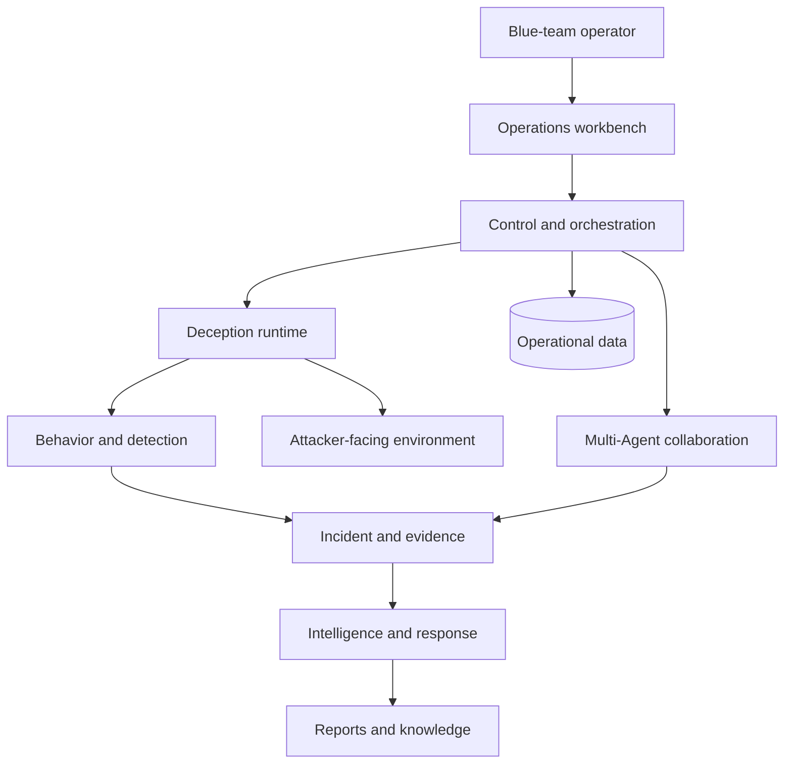

# Product Architecture

V3il is an autonomous blue-team operations platform built around deception as an observation surface. It continuously receives attacker interaction, correlates related behavior into Incidents, and coordinates multi-Agent investigation, adaptive engagement, risk decisions, and intelligence delivery.

## Design Goals

The architecture supports four product goals:

- **Continuous context:** Environments, behavior, tasks, evidence, analysis, and reports remain organized around the same Incident.
- **An active observation surface:** Deception environments can change in response to investigative hypotheses, and new interaction returns to the same behavior timeline.
- **Reviewable conclusions:** Material decisions remain connected to task scope, evidence, and analytical versions.
- **Operator control:** Operators govern environment policy, material approvals, Incident progress, and final delivery.

## Architecture Layers

| Layer | Product responsibility |
| --- | --- |
| Operations workbench | Presents Command Center, environment, Incident, detection, intelligence, knowledge, Agent, and infrastructure views. |
| Control and orchestration | Manages identity, resources, workflows, task state, recovery, and coordination across the platform. |
| Multi-Agent collaboration | Assigns investigation, deception, intelligence, and response work, with V3il coordinating and reviewing results. |
| Deception runtime | Runs isolated environments on Managed Hosts with attacker-facing services, environment versions, and egress policy. |
| Behavior and detection | Combines environment telemetry and Zeek signals into correlatable behavior timelines and detection results. |
| Incident and evidence | Manages event relationships, investigation tasks, evidence, analytical versions, audit history, and report state. |
| Data and knowledge | Stores operational state, investigation history, reports, and LightRAG knowledge. |

## Core Flow

### 1. Environment Design And Launch

The operator selects the runtime location, image, network policy, and adaptation mode, then uses the Agent Console to describe the business context, target persona, service shape, and observation priorities. Ph4ntom turns that context into a versioned environment and verifies the deployment.

### 2. Observation And Incident Correlation

A live environment produces network, process, command, file, authentication, service, and egress signals. Zeek and behavior policies identify material activity. Correlation maintains a ThreatIncident from source, behavioral, and temporal relationships.

### 3. Investigation And Adaptive Engagement

V3il creates the investigation plan. H4wk, L1ly, J4ck, and Ph4ntom contribute behavior analysis, intelligence, risk and response, and environment adaptation. New environment versions can test a hypothesis or encourage the attacker to reveal another step.

### 4. Decision And Delivery

Evidence-backed conclusions retain version history. Once the investigation meets its quality criteria, V3il produces intent, attack-chain reconstruction, a profile, risk assessment, response guidance, and a final report. The report can be published to knowledge and exported with its evidence.

## Business Workspaces

V3il maintains two canonical operating spaces. A **Threat Incident** brings correlated behavior, tasks, evidence, analysis, decisions, reporting, and knowledge publication into one investigation record. A **Deception Environment** brings attacker-facing services, versioned change, runtime state, detection coverage, and observed behavior into one engagement record.

Each Incident and Environment owns one Agent Session. The workspace, Agent Console, and Agent Operations open the same Session, preserving the team's accepted history and current work across navigation and browser connections.

## Agent Collaboration Model

| Concept | Product responsibility |
| --- | --- |
| Session | Durable collaboration space and ordered operational history. |
| Run | One accepted objective owned by the main Agent or a specialist. |
| Attempt | One execution of a Run and its recovery boundary. |
| Context | Persistent role-specific memory with decision and evidence provenance. |

V3il coordinates the Agent Defense Team through scoped delegation. A Run can wait for one named specialist result or Sandbox operation and continues once when that result is ready. Confirmed outcomes remain part of the Session; uncertain external actions enter the recovery queue for operator resolution. Context compression retains material decisions, evidence, tool results, and unresolved questions during long investigations.

## Main Workspaces

- **Command Center:** Overall status for environments, Incidents, detections, Agent work, and infrastructure.
- **Deception Environments:** Environment goals, versions, services, behavior, and runtime state.
- **Incident Workspace:** Timeline, tasks, evidence, analysis, adaptive engagement, audit, and reporting.
- **Detection:** Zeek and behavior policy, deployment state, and decisions.
- **Threat Intelligence:** Indicators, attacker profiles, risk assessments, and intelligence reports.
- **Agent Operations:** Active Runs, specialist dependencies, recovery decisions, reviews, and durable Session history.
- **Infrastructure:** Hosts, images, containers, proxies, terminals, and files.
- **Knowledge Base:** Reports and research material for retrieval and reuse.

## Operational Boundary

The control plane, database, model credentials, Docker management interfaces, reports, and evidence are trusted assets. Run attacker-facing environments on isolated, replaceable infrastructure. Establish clear controls for administrative access, sensitive data, evidence retention, and environment disposal.
