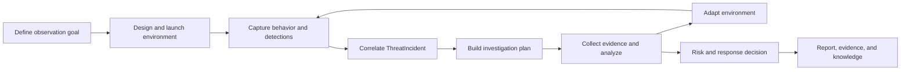

# End-to-End Workflow

The V3il workflow begins with environment design and ends with a reviewable investigative conclusion. Environment adaptation provides a feedback path throughout the operation, allowing the blue team to test a hypothesis and observe what the attacker does next.

## Workflow Overview

## 1. Define The Observation Goal

The operator identifies the attack surface, business context, target persona, and interactions worth observing, such as authentication, privilege escalation, data access, lateral movement, or command execution. Runtime host, image, egress policy, and adaptation mode establish the operating boundary.

Reference sites, source code, documents, and sample data can guide the environment design. The Agent Console captures the business context, realistic content, and observation priorities.

## 2. Design And Launch The Environment

V3il assigns environment design to Ph4ntom. Ph4ntom plans services, identities, data, interaction paths, and observation points from the stated goal and reference material. The platform deploys and verifies the resulting environment version before it becomes active.

Each version records its purpose, expected change, and verification outcome. The version history explains how the current environment came to exist.

## 3. Capture Behavior And Detection Signals

A live environment produces network, process, command, file, authentication, service, and egress activity. Zeek and behavior policies add protocol analysis and detection decisions.

V3il organizes these signals on a shared timeline with source and integrity context. An operator can trace an action back to its environment, session, and surrounding behavior.

## 4. Correlate A ThreatIncident

Correlation uses behavioral, source, and temporal relationships to add activity to an existing Incident or create a new one. An Incident can span multiple deception environments and present a cross-service or multi-stage attack path.

The Incident becomes the shared context for environments, behavior, detections, tasks, evidence, analysis, audit, and reporting.

## 5. Run The Multi-Agent Investigation

V3il creates a plan of scoped questions with owners and completion criteria. The specialists contribute as follows:

- H4wk reconstructs behavior, timelines, attack paths, and intent.
- Ph4ntom evaluates environment changes that could improve observation.
- L1ly develops indicators, external context, and the attacker profile.
- J4ck assesses risk, response priorities, and defensive improvements.
- V3il coordinates the work, resolves disagreements, and reviews conclusions.

Tasks remain connected to relevant behavior and evidence, making the basis and coverage of each conclusion visible.

## 6. Adapt The Environment

When the evidence raises a new question, Ph4ntom can propose an environment change: another service clue, a different response, a richer identity relationship, or a new observation point.

`policy_auto` can apply low-risk changes allowed by policy. `manual_approval` routes changes through operator review. Once deployed, the new version continues to feed the same observation and Incident workflow.

## 7. Reach Intelligence And Response Decisions

The investigation develops intent, attack-chain reconstruction, threat indicators, an attacker profile, and risk assessment. J4ck turns those conclusions into stop conditions, response priorities, and defensive improvements. V3il checks the conclusions for consistency and evidence support.

New material behavior can extend the investigation. Analytical history shows how the team's judgment changed over time.

## 8. Deliver Reports And Knowledge

When tasks, evidence, and analysis meet the delivery criteria, V3il creates the final report and evidence package. The report references fixed analytical and evidence versions for later review.

Final work can be published to LightRAG so future investigations can retrieve similar behavior, prior conclusions, and response experience.

## Operator Decisions

Operators retain direct control over:

- runtime location, image, network policy, and adaptation mode;
- approval of high-risk environment changes;
- task priority and Incident progression;
- review of evidence, analysis, and Agent work;
- the decision to enter final reporting and closure;
- export, retention, and disposal of environments and evidence.
