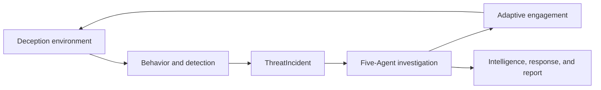

## Core Workflow

V3il begins with real interaction between an attacker and a controlled environment. The environment provides the observation surface, behavior and detection signals enter an Incident, and the Agent team uses evidence to investigate, adapt the environment, or reach a response decision.

Continue with [Product Architecture](/en/guide/overview), [End-to-End Workflow](/en/guide/workflow), [Deception Environments](/en/guide/deception), and [Investigation And Evidence](/en/guide/investigation).
