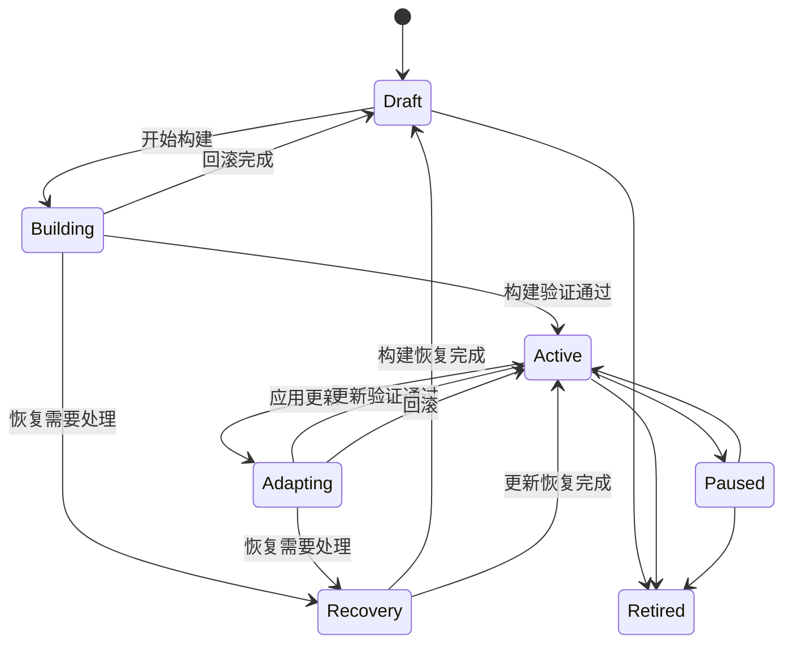

# 欺骗环境

欺骗环境是 V3il 的观测入口。每个环境围绕特定业务背景和观察目标设计，承载攻击者可见的服务、身份、数据与交互路径，并持续向 Incident 提供行为和检测信号。

## 环境设计

创建环境时需要确定以下内容：

| 设计要素 | 说明 |
| --- | --- |
| 名称与说明 | 标识环境用途、业务背景和运营负责人。 |
| Sandbox Container | 可选择一个尚未绑定、正在运行且已有业务端口映射的容器；选择后该容器由此环境独占。 |
| Managed Host | 选择环境运行的 Docker 主机。 |
| Sandbox Image | 选择运行基线和可用能力。 |
| 外联策略 | 控制环境对外访问方式与网络身份。 |
| 适配模式 | 选择策略自动执行或人工审批。 |
| 参考资料 | 提供站点、代码、文档、压缩包或其他设计材料。 |

不选择已有容器时，V3il 会保存 Managed Host、Sandbox Image 和外联配置，并在首次环境版本执行时创建专用容器。选择已有容器时，主机、镜像、外联和端口映射取自该容器且不可在环境版本中替换。创建完成后，操作者进入环境 Agent Console，描述目标角色、服务形态、可信数据、交互路径和观察重点。Ph4ntom 根据这些信息设计环境。

## 生命周期

### 设计与部署

Ph4ntom 将自然语言目标和参考资料整理为环境版本，定义需要呈现的服务、身份、数据、交互与监测点。平台在选定主机上部署环境，并对关键交互进行验证。

### 运行与观察

环境上线后，攻击者可见服务持续接收互动。行为遥测和检测信号进入 V3il，环境工作区展示当前服务、运行状态、行为记录和版本历史。

### 调整与回滚

调查中出现新假设时，Ph4ntom 可以提出环境调整。每次调整都包含目的、预期效果、风险和验证结果。验证失败时，平台保留失败信息并回到可继续运营的状态。

每个环境版本都会记录已应用基线，并通过明确的执行检查点逐步推进。服务变更、容器操作、检测更新和验证结果都归属于该版本。执行成功后，新版本成为下一次变更的基线；执行失败后，平台恢复此前基线，并记录恢复后的环境状态供操作者复核。

长时间沙箱命令以持久化批次执行。发起批次的 Agent 工作会等待这项确定操作，并在合并结果就绪后继续一次。取消操作会传递到排队中和执行中的命令。命令输出、环境状态和发起请求的 Agent 上下文由此在执行进程重启后保持一致。

检测变更沿用同一版本边界。规则经过验证后关联目标传感器，部署结果与健康状态持续记录在该版本中。恢复过程会将检测状态与环境基线一起恢复，为后续调查提供一致的观测面。

### 暂停与退役

操作者可以根据调查进度暂停、恢复或退役环境。退役前应确认相关证据、报告和留存策略已经完成。

## 动态诱导

动态诱导的价值在于围绕调查问题改变环境信号。常见场景包括：

- 为已观察到的攻击路径补充下一阶段入口；
- 调整内容、身份或数据，验证攻击者的目标偏好；
- 增加新的服务关系，观察横向移动和工具选择；
- 针对特定技术增加监测点；
- 收敛高风险交互，控制环境暴露面。

环境调整由 Incident 中的行为和证据触发。Ph4ntom 负责设计与验证，V3il 负责将其纳入调查计划和复核。

## 适配模式

- **`policy_auto`：** 符合策略的低风险调整可以自动执行，适合持续运行的研究环境；
- **`manual_approval`：** 每次调整由操作者确认，适合生产相邻网络、敏感主题和严格变更流程。

无论采用哪种模式，环境工作区都会保留调整目的、执行状态和验证结果。

## 行为观测

V3il 关注环境中的网络、进程、命令、文件、认证、服务、系统调用和外联活动。Zeek 提供协议与流量层检测，环境传感器补充主机和应用行为。

环境工作区用于观察单个环境的运行细节；Incident 工作区负责将多个环境和时间段中的相关行为放在同一调查上下文中。

## 运营管理

管理员可以通过基础设施页面管理：

- 本地和远程 Managed Host；
- Sandbox Image 与运行容器；
- 端口和外联代理；
- 容器生命周期；
- 可信终端和文件；
- 检测运行时与状态。

这些能力用于环境准备、故障处理和运营审计。容器管理页中已经创建、启动且尚未绑定的容器可以直接用于欺骗环境；绑定后的容器不能被其他环境选择或删除。攻击者可见网络应与管理网络隔离。

## 失败处理

环境构建或更新失败时，V3il 会自动恢复到此前可用的状态。工作区持续展示失败原因与恢复结果，操作者修正设计后可以提交新的版本。如果自动恢复未能完成，环境会明确标记为需要处理，并暂停后续变更，直至恢复成功。操作者提供的运行资源始终由操作者控制；未成功构建时由平台临时分配的资源会被自动清理。

恢复可以从最后一个已记录检查点继续。工作区会展示失败步骤、已经完成的回滚工作、剩余恢复工作和目标基线。操作者发起恢复后，平台沿用原版本记录继续处理，并保留完整版本历史。恢复完成后，首次构建失败的环境回到 `draft`，调整失败的环境回到 `active`。
