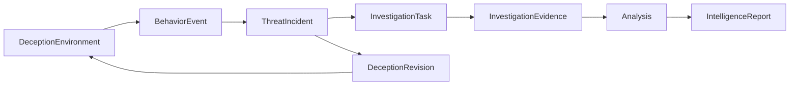

# 核心领域模型

V3il 的领域模型围绕一条清晰关系展开：欺骗环境产生行为，相关行为进入 Incident，调查任务引用行为并形成证据，证据支撑分析，分析最终进入报告与知识库。

## 运行资源

| 概念 | 作用 |
| --- | --- |
| System User | 表示平台操作者及其权限。 |
| Managed Host | 表示可承载环境和检测运行时的 Docker 主机。 |
| Sandbox Image | 定义环境的运行基线。 |
| Sandbox Container | 表示实际运行的环境或检测实例。 |
| Egress Proxy | 定义受控外联路径。 |

运行资源归控制平面管理，为欺骗环境提供可选择、可审计的基础设施。

## 欺骗环境与版本

### DeceptionEnvironment

DeceptionEnvironment 表示一个持续运营的欺骗场景。它保存环境身份、业务背景、运行位置、网络策略、当前服务、适配模式和生命周期状态。

环境是调查中的长期对象。攻击者可见内容会随版本变化，环境身份和行为历史保持连续。

### DeceptionRevision

DeceptionRevision 表示一次环境设计或调整。每个版本记录目标、变化内容、触发原因、风险、执行状态和验证结果。

版本关系使团队能够回答：

- 当前环境为什么呈现这些服务和数据；
- 哪次调整由哪些行为或调查假设触发；
- 变更是否达到预期效果；
- 失败后环境回到了什么状态。

## 行为与检测

### BehaviorEvent

BehaviorEvent 表示一次规范化的攻击行为或环境活动。网络、进程、命令、文件、认证、服务、系统调用和外联信号使用共同结构进入时间线。

事件保留来源、环境、时间、原始上下文和完整性信息，既服务实时关联，也作为后续证据的原始依据。

### Detection Policy and Decision

检测策略描述 Zeek 或行为层面的识别逻辑；检测结果记录策略对具体行为的判断。策略版本、部署状态和结果彼此关联，便于分析检测效果。

## ThreatIncident

ThreatIncident 表示一次需要持续跟踪的攻击活动。它可以关联多个环境和行为，维护观察时间、严重度、置信度、风险、摘要和生命周期。

Incident 是调查、动态诱导和报告的共同边界。环境提供观察面，行为提供事实，任务组织分析过程，报告固定最终结论。

## 调查任务与证据

### InvestigationTask

InvestigationTask 表示一个边界清楚的调查问题，包含负责人、优先级、行为范围、依赖关系和完成标准。

### InvestigationEvidence

InvestigationEvidence 将分析陈述与具体行为和任务连接起来。证据记录保持稳定，后续分析可以增加或修订，原始引用不会丢失。

任务和证据的关系使调查具备可分工、可复核和可追踪的结构。

## 分析与情报

V3il 维护以下分析对象：

| 分析对象 | 关注内容 |
| --- | --- |
| Intent Assessment | 攻击阶段、目标、可信度和后续动作假设。 |
| Attack Chain | 攻击步骤、因果关系、证据和缺口。 |
| Threat Indicator | 可检索和可用于响应的指标及其上下文。 |
| Attacker Profile | 目标偏好、能力、工具、行为模式和归因边界。 |
| Risk Assessment | 影响、紧迫度、停止条件、响应建议和残余风险。 |

分析采用版本化方式保存。当前版本用于运营决策，历史版本用于解释判断如何变化。

## 报告、知识与审计

### IntelligenceReport

IntelligenceReport 汇总 Incident 的关键分析、证据范围、响应建议和结论。报告引用确定的分析与证据版本，后续更新不会改变已发布内容。

### Knowledge

最终报告和研究资料可以进入 LightRAG，形成跨 Incident 的检索与知识关联。

### Audit Event

审计记录覆盖环境版本、Incident 状态、任务、证据、分析、智能体协作和报告发布等关键动作。它提供运营过程的时间线，而不承担业务事实本身。

## 建模原则

- 环境、Incident 和报告提供稳定的业务边界；
- 行为与证据保留原始来源；
- 分析和环境变化采用版本化记录；
- 关系对象保留事件、环境、任务和证据之间的来源信息；
- 当前状态服务运营视图，历史版本服务复核与审计；
- 敏感数据按照可信管理网络的安全要求处理。
