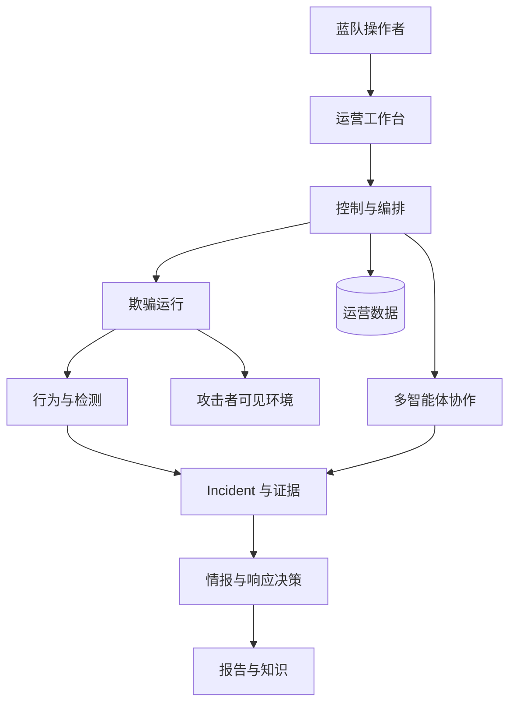

# 产品架构

V3il 是一套以欺骗环境为观测入口的自主蓝队运营平台。系统持续接收攻击者与环境的互动，将相关行为关联为 Incident，再通过多智能体协作完成调查、动态诱导、风险判断和情报交付。

## 设计目标

V3il 的架构服务于四个产品目标：

- **保持上下文连续：** 环境、行为、任务、证据、分析和报告围绕同一 Incident 组织；
- **让环境参与调查：** 欺骗环境可以根据调查假设调整，新的互动继续回到行为时间线；
- **让结论可复核：** 重要判断需要对应任务、证据和分析版本；
- **保留人工控制：** 操作者管理环境策略、关键审批、Incident 进程和最终交付。

## 架构分层

| 层级 | 产品职责 |
| --- | --- |
| 运营工作台 | 提供 Command Center、环境、Incident、检测、情报、知识、智能体和基础设施视图。 |
| 控制与编排层 | 管理身份、资源、工作流、任务状态、恢复和跨模块协调。 |
| 多智能体协作层 | 按角色分配调查、欺骗、情报和响应工作，并由 V3il 负责统筹与复核。 |
| 欺骗运行层 | 在 Managed Host 上运行独立环境，承载攻击者可见服务、环境版本和外联策略。 |
| 行为与检测层 | 汇聚环境遥测和 Zeek 信号，形成可关联的行为时间线与检测结果。 |
| Incident 与证据层 | 管理事件关系、调查任务、证据、分析版本、审计和报告状态。 |
| 数据与知识层 | 保存运营状态、调查历史、报告与 LightRAG 知识。 |

## 核心链路

### 1. 环境设计与上线

操作者选择运行位置、镜像、网络策略和适配模式，并通过 Agent Console 描述业务背景、目标角色、服务形态和观察重点。Ph4ntom 将这些信息整理为环境版本，完成部署与验证。

### 2. 行为观测与 Incident 关联

环境上线后持续产生网络、进程、命令、文件、认证、服务和外联信号。检测层结合 Zeek 与行为规则识别重要活动，关联模块按攻击来源、行为特征和时间关系维护 ThreatIncident。

### 3. 调查与动态诱导

V3il 根据 Incident 当前状态制定调查计划，H4wk、L1ly、J4ck 和 Ph4ntom 分别负责行为研判、情报分析、风险响应和环境调整。新的环境版本用于验证假设或引导攻击者暴露更多行为。

### 4. 结论与交付

调查结论以证据为依据，并保留历史版本。达到质量要求后，平台形成攻击意图、攻击链、画像、风险、响应建议、最终报告和证据包。知识发布沿用已经固定的报告内容独立推进，报告在发布期间持续可用。

## 业务空间

V3il 维护两类权威运营空间。**Threat Incident** 将关联行为、任务、证据、分析、决策、报告和知识发布组织为一份调查记录；**Deception Environment** 将攻击者可见服务、版本变化、运行状态、检测覆盖和行为观测组织为一份诱捕记录。

每个 Incident 和 Environment 拥有唯一的 Agent Session。业务工作区、Agent Console 与 Agent Operations 打开同一个 Session，团队已经接受的历史和当前工作可以跨页面与浏览器连接持续使用。

## Agent 协作模型

| 概念 | 产品职责 |
| --- | --- |
| Session | 持久协作空间与有序运营历史。 |
| Run | 主 Agent 或专家承担的一项已接受工作目标。 |
| Attempt | 同一个 Run 的一次执行及其恢复边界。 |
| Context | 一个角色的持久工作记忆，保留决策与证据来源。 |

V3il 通过范围明确的委派协调 Agent Defense Team。Run 可以等待一个指定专家结论或 Sandbox 操作，并在结果就绪时继续一次。已经确认的结果保留在 Session 中；存在歧义的外部操作进入恢复队列，由操作者完成判断。长周期调查中的上下文压缩会保留重要决策、证据、工具结果和未解决问题。

## 核心工作区

- **Command Center：** 查看环境、Incident、检测、智能体和基础设施的整体状态；
- **Deception Environments：** 管理环境目标、版本、服务、行为和运行状态；
- **Incident Workspace：** 处理时间线、任务、证据、分析、动态诱导、审计和报告；
- **Detection：** 管理 Zeek 与行为检测策略，查看部署和判定结果；
- **Threat Intelligence：** 查看指标、攻击者画像、风险评估和情报报告；
- **Agent Operations：** 跟踪 Run、专家依赖、恢复决策、复核和 Session 历史；
- **Infrastructure：** 管理主机、镜像、容器、代理、终端和文件；
- **Knowledge Base：** 保存报告与研究资料，支持后续检索和复用。

## 运营边界

控制平面、数据库、模型凭据、Docker 管理接口、报告和证据文件属于可信资产。攻击者可见环境应部署在独立网络和可替换基础设施上。组织需要为管理访问、敏感数据、证据留存和环境销毁建立明确制度。
