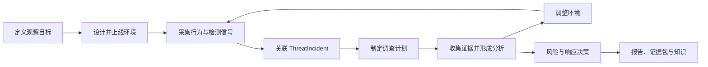

# 端到端流程

V3il 的工作链路从环境设计开始，以可复核的调查结论结束。环境调整作为反馈回路贯穿调查过程，使蓝队能够根据新证据验证假设并观察攻击者后续动作。

## 流程总览

## 1. 定义观察目标

操作者先明确希望观察的攻击面、业务背景、目标角色和关键交互，例如登录、权限提升、数据访问、横向移动或命令执行。运行主机、镜像、外联策略和适配模式共同构成环境的运营边界。

参考站点、代码、文档和数据样本可以作为环境设计材料。Agent Console 用于补充业务语境、可信内容和预期观察重点。

## 2. 设计并上线环境

V3il 将环境设计交给 Ph4ntom。Ph4ntom 根据目标和参考资料规划服务、身份、数据、交互路径与监测点，并生成可执行的环境版本。平台完成部署与验证后，环境进入运行状态。

每次环境版本都记录设计目的、预期变化和验证结果。操作者可以查看版本历史，理解当前环境由哪些决策形成。

## 3. 采集行为与检测信号

攻击者与环境互动时，V3il 持续采集网络、进程、命令、文件、认证、服务和外联行为。Zeek 与行为检测策略补充协议分析和规则判定。

这些信号被整理为同一时间线，并保留来源和完整性信息。蓝队可以从单个动作回溯到环境、会话和相关行为。

## 4. 关联 ThreatIncident

关联模块根据行为特征、来源和时间关系，将活动加入现有 Incident 或建立新的 Incident。一个 Incident 可以覆盖多个欺骗环境，以呈现跨服务或跨阶段的攻击过程。

Incident 是后续调查的共同上下文，包含环境范围、行为时间线、检测结果、任务、证据、分析、审计和报告。

## 5. 协调可持续恢复的 Agent 工作

打开 Incident 或环境 Console 时，平台始终回到该业务对象唯一的 Agent Session。请求被平台接受后，执行会独立于浏览器连接继续推进。操作者可以离开、重连，或者从其他入口打开同一 Session，并恢复完全一致的有序历史。

V3il 推进主调查，同时把边界明确的问题委派给专家 Run。每个专家获得隔离的上下文和清晰的任务范围。主 Run 依赖专家结论或长时间沙箱操作时，会针对该项确定依赖暂停，并在预期结果到达后继续。并行工作始终归属于各自的调查分支。

长周期调查通过上下文压缩保留重要决策和证据。执行进程中止后，新的 Attempt 接管任务，未完成上下文被移除，已经确认的工具结果被安全复用；结果不确定的外部操作会等待恢复流程确认状态。实时更新可以从持久化历史补放，因此 Agent Console 始终呈现同一份运营记录。

## 6. 多智能体调查

V3il 负责制定调查计划，将问题拆分为有负责人、有范围、有完成标准的任务。专家围绕任务开展工作：

- H4wk 重建行为、时间线、攻击过程和意图；
- Ph4ntom 评估环境变化对后续观察的价值；
- L1ly 整理指标、外部上下文和攻击者画像；
- J4ck 评估风险、响应优先级和防御改进；
- V3il 协调任务、处理分歧并复核结论。

调查任务与具体行为和证据关联，便于理解每个结论的依据与覆盖范围。

## 7. 动态诱导

当现有证据提出新的问题时，Ph4ntom 可以规划环境调整，例如增加服务线索、改变响应内容、扩展身份关系或布置新的观察点。

`policy_auto` 适合风险较低、策略允许的调整；`manual_approval` 将变更交给操作者审批。调整上线后继续接受同一套行为观测和 Incident 关联。

## 8. 形成情报与响应决策

调查逐步形成攻击意图、攻击链、威胁指标、攻击者画像和风险评估。J4ck 据此提出停止条件、响应优先级和防御改进，V3il 负责检查结论之间是否一致、证据是否充分。

新的重要行为会推动调查继续，现有分析保留历史版本，团队可以清楚看到判断如何变化。

## 9. 报告与知识沉淀

当任务、证据和分析达到交付要求后，V3il 生成最终报告与证据包。报告固定引用的分析和证据版本，便于后续复核。

最终成果可以发布到 LightRAG，供后续调查检索相似行为、历史结论和处置经验。

最终化会形成一份固定的运营记录。V3il 固定报告引用的分析与证据，记录主 Agent 的最终结果，并把知识发布作为可持续恢复的后续工作。知识发布重试会复用同一份最终报告和已经完成的调查状态。

## 操作者决策点

操作者在以下环节保留明确控制权：

- 选择环境运行位置、镜像、网络策略和适配模式；
- 审批高风险环境调整；
- 调整任务优先级与 Incident 进程；
- 复查证据、分析和智能体运行；
- 决定何时进入最终报告和关闭阶段；
- 导出、留存或销毁环境、报告和证据。
