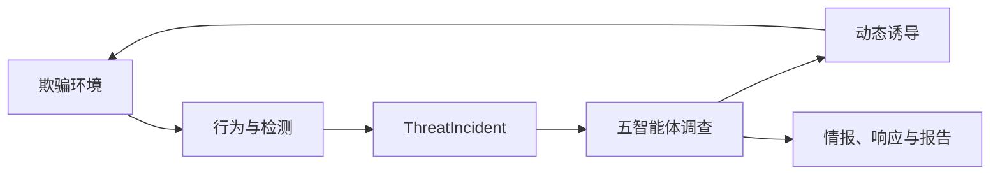

## 核心链路

V3il 从攻击者与环境的真实互动出发。环境提供可控的观察面，行为与检测信号进入 Incident，智能体团队围绕证据开展调查，并根据判断调整环境或形成响应结论。

继续阅读[产品架构](/zh/guide/overview)、[端到端流程](/zh/guide/workflow)、[欺骗环境](/zh/guide/deception)和[调查与证据](/zh/guide/investigation)。
