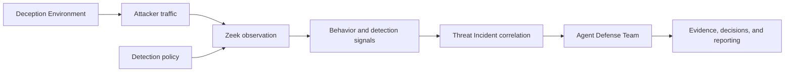

# V3il Zeek Detection Runtime

The Zeek Detection Runtime is V3il's network observation plane for Managed Hosts. It turns attacker traffic from Deception Environments into structured behavior and detection signals that can participate in Threat Incident correlation, investigation, evidence review, and reporting.

## Product Role

Deception Environments create controlled opportunities for interaction. The Zeek runtime adds protocol-level visibility to those interactions and gives the blue team a consistent network view across isolated hosts. Its responsibilities are:

- observe traffic associated with attacker-facing environments;
- apply the detection policy assigned to each Managed Host;
- normalize protocol activity into the shared behavior model;
- preserve signal order and integrity context;
- report runtime and policy health to the V3il control plane.

## Architecture

The runtime contains three product responsibilities:

| Responsibility | Product outcome |
| --- | --- |
| Network observation | Captures the traffic visible on the selected Managed Host interface. |
| Detection evaluation | Applies the active Zeek policy and records the policy version behind each result. |
| Behavior publication | Converts network activity into ordered V3il behavior events with source and integrity context. |

The control plane manages sensor identity, policy assignment, deployment state, and health. The runtime remains attached to one Managed Host observation boundary, while Threat Incidents can correlate behavior across several hosts and environments.

## Core Signal Chain

Each published signal retains the Managed Host, sensor, environment context, observation time, and detection policy relationship required for later review. Incident correlation can combine these network signals with process, command, file, authentication, service, and egress behavior.

## Detection Lifecycle

Detection policy is managed as a versioned operational resource. A policy change moves through validation, target assignment, deployment, health observation, and review. The active version remains visible alongside the behavior it classified, allowing investigators to understand the detection context behind a decision.

Deployment failures and uncertain runtime state enter an explicit recovery path. The workbench keeps the target host, intended policy version, current sensor state, and recovery outcome together so operators can restore a known observation baseline.

## Investigation Collaboration

Zeek signals contribute to the same Threat Incident timeline used by behavior records, investigation tasks, evidence, deception revisions, and audit decisions. H4wk can use protocol activity to reconstruct attack paths, L1ly can develop indicators, J4ck can assess exposure and response priorities, and Ph4ntom can refine the observation surface. V3il coordinates these conclusions within the canonical Incident Session.

## Operational Boundary

The detection runtime belongs on authorized Managed Hosts with an explicit capture scope. Sensor management stays within the trusted management network, and attacker-facing traffic remains isolated from control-plane and production assets. Packet access, signal retention, policy approval, and evidence handling follow the organization's operational authority and data governance requirements.
